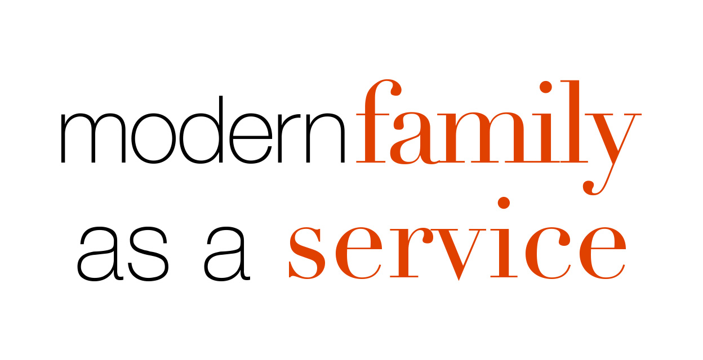

# MFaaS - Modern Family as a Service


This is an api with which you can get quotes from modern family. You can filter by the actor or the content of the quote. Or you can just get random quotes.


## Websites
Overview: [https://stitti.github.io/MFaaS/](https://stitti.github.io/MFaaS/)

Api: [https://mfaas.azurewebsites.net](https://mfaas.azurewebsites.net)

## API
### Quotes
#### `GET /api/quotes`
Returns all quotes.
> [https://mfaas.azurewebsites.net/api/quotes](https://mfaas.azurewebsites.net/api/quotes)
```json
[
  {
    "quote": "if it were easy, everyone would be hot.",
    "actor": "Haley Dunphy"
  },
  {
    "quote": "The minute they got rid of rotary phones, everything went to hell.",
    "actor": "Jay Pritchett"
  }
]
```

#### `GET /api/quotes/random`
Returns a random quote.
> [https://mfaas.azurewebsites.net/api/quotes/random](https://mfaas.azurewebsites.net/api/quotes/random)
```json
{
  "quote": "With great hotness comes great responsibility",
  "actor": "Haley Dunphy"
}
```

#### `GET /api/quotes/random/{count}`
Returns an array with `{count}` quotes e.g. `GET /api/quotes/random/3`.
> [https://mfaas.azurewebsites.net/api/quotes/random/3](https://mfaas.azurewebsites.net/api/quotes/random/3)
```json
[
  {
    "quote": "I'm cool dad, that's my thang. I'm hip, I surf the web, I text. LOL: laugh out loud, OMG: oh my god, WTF: why the face.",
    "actor": "Phil Dunphy"
  },
  {
    "quote": "Comfort is not everything. My toes have been numb since my Quinceanera.",
    "actor": "Gloria Delgado-Pritchett"
  },
  {
    "quote": "Manny thinks his dad is like Superman. The truth? He's a total flake. In fact, the only way he's like Superman... is that they both landed in this country illegally.",
    "actor": "Jay Pritchett"
  }
]
```

#### `GET /api/quotes/actor/{actor}`
Returns a list of all quotes of actors whose name matches the value of `{actor}` e.g. `GET /api/quotes/actor/mitchell%20pritchett`.
> [https://mfaas.azurewebsites.net/api/quotes/actor/mitchell%20pritchett](https://mfaas.azurewebsites.net/api/quotes/actor/mitchell%20pritchett)
```json
[
  {
    "quote": "I came out of the closet in my mid-twenties. I had to actually come out to my dad three times before he finally acknowledged it. I'm not sure if maybe he was hoping he heard it wrong like I had said, Dad, I'm gray",
    "actor": "Mitchell Pritchett"
  },
  {
    "quote": "Everyone's staring at us. I haven't been judged by this many people since I forgot my canvas bags at Whole Foods.",
    "actor": "Mitchell Pritchett"
  },
  {
    "quote": "Usually when everything's normal, people don't respond in perfectly rehearsed unison.",
    "actor": "Mitchell Pritchett"
  },
  {
    "quote": "I don't wanna meet anything on Monday that I'm gonna eat on Friday.",
    "actor": "Mitchell Pritchett"
  }
]
```

#### `GET /api/quotes/actor/query/{query}`
Returns a list of all quotes of actors whose name contains the value of `{query}` e.g. `GET /api/quotes/actor/query/dunphy`.
> [https://mfaas.azurewebsites.net/api/quotes/actor/query/dunphy](https://mfaas.azurewebsites.net/api/quotes/actor/query/dunphy)
```json
[
  {
      "quote": "uccess is 1% inspiration, 98% perspiration, and 2% attention to detail.",
      "actor": "Phil Dunphy"
    },
    {
      "quote": "if it were easy, everyone would be hot.",
      "actor": "Haley Dunphy"
    },
    {
      "quote": "When life gives you lemonade, make lemons. Life will be all, Whaaat?",
      "actor": "Phil Dunphy"
    },
    {
      "quote": "I've been thinking of moving out for some time now. There's a line of ants going to a trick-or-treat bag in my closet, and I don't want to still be here when     they get sick of candy.",
      "actor": "Luke Dunphy"
    }
  ]
```

#### `GET /api/quotes/query/{query}`
Returns a list of all quotes that contain the value of `{query}` e.g. `GET /api/quotes/query/tongue`.
> [https://mfaas.azurewebsites.net/api/quotes/query/tongue](https://mfaas.azurewebsites.net/api/quotes/query/tongue)
```json
[
  {
    "quote": "What could be more natural than your mother's tongue in your ear?",
    "actor": "Gloria Delgado-Pritchett"
  }
]
```

### Actors
#### `GET /api/actors`
Returns all actors
> [https://mfaas.azurewebsites.net/api/actors](https://mfaas.azurewebsites.net/api/actors)
```json
[
  {
    "name": "Phil Dunphy",
    "gender": "male"
  },
  {
    "name": "Claire Dunphy",
    "gender": "female"
  },
  {
    "name": "Luke Dunphy",
    "gender": "male"
  }
]
```
#### `GET /api/actors/name/{name}`
Returns the actor whose name matches the value of `{name}` e.g. `GET /api/actors/name/phil%20dunphy`.
> [https://mfaas.azurewebsites.net/api/actors/name/phil%20dunphy](https://mfaas.azurewebsites.net/api/actors/name/phil%20dunphy)
```json
{
  "name": "Phil Dunphy",
  "gender": "male"
}
```

#### `GET /api/actors/gender/{gender}`
Returns the actors whose gender matches the value of `{gender}` e.g. `GET /api/actors/gender/male`.
```json
[
  {
    "name": "Phil Dunphy",
    "gender": "male"
  },
  {
    "name": "Luke Dunphy",
    "gender": "male"
  },
  {
    "name": "Jay Pritchett",
    "gender": "male"
  }
]
```

#### `GET /api/actors/query/{query}`
Returns the actors whose name contains the value of `{query}` e.g. `GET /api/actors/query/dunphy`.
```json
[
  {
    "name": "Phil Dunphy",
    "gender": "male"
  },
  {
    "name": "Claire Dunphy",
    "gender": "female"
  },
  {
    "name": "Luke Dunphy",
    "gender": "male"
  },
  {
    "name": "Haley Dunphy",
    "gender": "female"
  },
  {
    "name": "Alex Dunphy",
    "gender": "female"
  }
]
```

## Contributing
If you want to contribute, add a quote in `quotes.json` or add a new actor in `actors.json`.

## License
            DO WHAT THE FUCK YOU WANT TO PUBLIC LICENSE
                    Version 2, December 2004

 Copyright (C) 2004 Sam Hocevar <sam@hocevar.net>

 Everyone is permitted to copy and distribute verbatim or modified
 copies of this license document, and changing it is allowed as long
 as the name is changed.

            DO WHAT THE FUCK YOU WANT TO PUBLIC LICENSE
   TERMS AND CONDITIONS FOR COPYING, DISTRIBUTION AND MODIFICATION

  0. You just DO WHAT THE FUCK YOU WANT TO.
